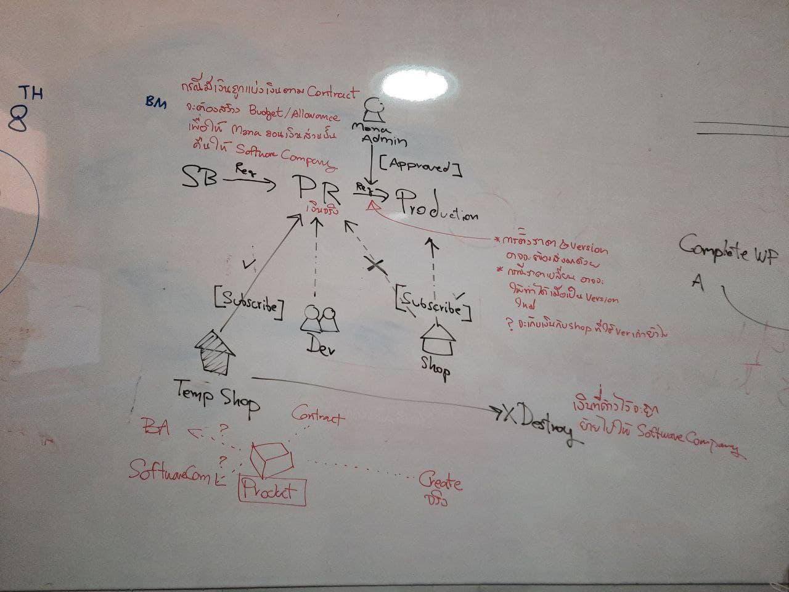

# Development life cycle

การพัฒนาระบบของ 3rd party ร่วมกับ mana มี Life cycle ที่เกี่ยวข้องกับการใช้งาน Environment ในแต่ละช่วงการทำงาน ทั้งนี้เพื่อรองรับกระบวนการตั้งแต่การเขียนโปรแกรม (Coding) เพื่อพัฒนาระบบให้เป็นไปตามรูปแบบที่กำหนดไว้, การทดสอบ (Testing) เพื่อหาข้อผิดพลาดซึ่งหากมีการพบข้อผิดพลาดในกระบวนการนี้ต้องรีบปรับปรุงแก้ไขให้เรียบร้อยก่อนโปรแกรมออกสู่ตลาดเพื่อการใช้งานจริง 

 การพัฒนาและทดสอบ (Development & Test) เป็นขั้นตอนการการเขียนโปรแกรม (Coding) เพื่อพัฒนาระบบจากแบบบนกระดาษให้เป็นระบบตามคุณลักษณะที่กำหนดไว้ จากนั้นทำการทดสอบหาข้อผิดพลาด (Testing) เพื่อตรวจสอบความถูกต้อง จนมั่นใจว่าถูกต้องและตรงตามความต้องการ หากพบว่ามีข้อผิดพลาดเกิดขึ้นจากการทำงานของระบบต้องปรับแก้ไขให้เรียบร้อยพร้อมใช้งานก่อนนำไปติดตั้งใช้จริง