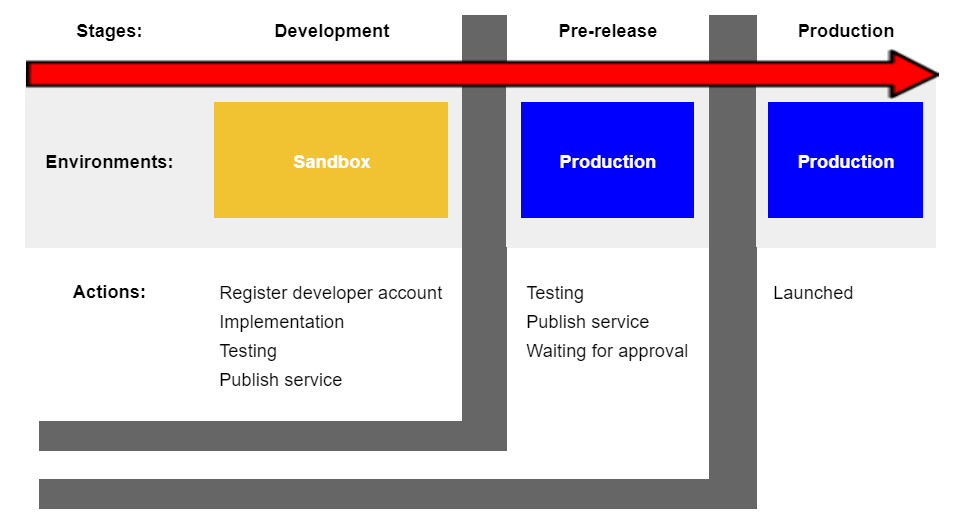

# Development life cycle
การพัฒนาระบบของ 3rd party ร่วมกับ mana มีขั้นตอนการพัฒนาที่รวบรวมไว้เป็นลำดับขั้นตามแต่ละช่วงการทำงาน ทั้งนี้เพื่อรองรับกระบวนการทำงานตั้งแต่การเริ่มพัฒนา, การเข้าสู่ช่วงทดสอบ ไปจนถึงการเผยแพร่เพื่อการใช้งานจริง ซึ่งจากที่กล่าวมาสามารถแบ่งวงจรการทำงานได้เป็นช่วงหลักๆดังนี้

### 1. ช่วงระยะพัฒนา (Development) 
เมื่อนักพัฒนาทำการพัฒนาระบบใดๆก็ตามที่มีการเชื่อมต่อกับ APIs ของ mana กระบวนการทั้งหมดที่เกิดขึ้นนี้จะอยู่ภายใต้ Sandbox environment ซึ่งในระหว่างนี้หากมีการทดสอบระบบใน Application นักพัฒนาจำเป็นต้องใช้ [mana sandbox application](../Quickstarts/test_in_sandbox.md) ควบคู่ไปกับการทดสอบของฝั่งนักพัฒนา หลังจากทดสอบระบบเรียบร้อยแล้วจึงทำการเชื่อมต่อกับ APIs เพื่อเตรียมเผยแพร่ออกสู่สาธารณะ

### 2. ช่วงระยะเตรียมปล่อยออกสู่สาธารณะ (Pre-release) 
เมื่อผ่านระยะพัฒนามาเรียบร้อยแล้วก่อนการนำระบบที่พัฒนาออกสู่ตลาดจะมีการนำระบบมาพักไว้ Stage ที่เรียกว่า Pre-release ซึ่งเป็น Stage ที่มีข้อมูลและสภาวะแวดล้อมทุกอย่างเสมือนจริง เพียงแต่ยังไม่ได้เผยแพร่ออกสู่ภายนอก

ดังนั้นหากนักพัฒนาต้องการจะทดสอบการใช้งานใน Stage นี้ก็สามารถทำได้ ซึ่งร้านค้าที่ถูกสร้างเพื่อทดสอบระบบนั้นขณะที่ใช้ Service ของนักพัฒนาจะถูกเรียกเก็บค่าใช้จ่ายเป็นเงินจริงตามที่ได้เขียนไว้ในระบบ ซึ่งรวมถึงการเก็บค่าบริการการตามสัญญาที่ได้ทำไว้กับทาง mana และเมื่อจบการทดสอบกระบวนการทำงานทั้งหมดที่ Stage นี้เรียบร้อยแล้วเงินที่ถูกจ่ายเข้ามาในระบบจะถูกคืนให้กับ Software company และร้านค้าที่ถูกสร้างขึ้นมาทั้งหมดในขั้นตอนนี้จะถูกทำลายทิ้ง

ซึ่งหลังจากที่นักพัฒนาทดสอบระบบเรียบร้อยและต้องการนำระบบเผยแพร่ออกสู่สาธารณะ จะต้องมีการแจ้งเข้ามาเพื่อให้ทาง mana ทำการตรวจสอบและเตรียมดำเนินการเผยแพร่ออกสู่สาธารณะ

### 3. ช่วงระยะเผยแพร่ (Production)
เมื่อมีการเผยแพร่ระบบออกสู่สาธารณะเรียบร้อยแล้ว ผู้ใช้งานภายนอกสามารถเข้าใช้งานความสามารถของนระบบที่ถูกพัฒนาได้อย่างเต็มรูปแบบ
