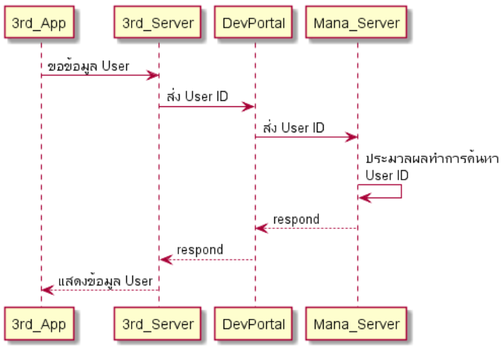

# mana  
mana เป็นแอพพลิเคชั่นที่เป็นกระเป๋าเงินอิเล็กทรอนิกส์รูปแบบหนึ่งซึ่ง สามารถทำธุรกรรมการเงินส่วนบุคคล ร้านค้า หรือระดับองค์กรหรือจะเลือกความสามารถในการสร้างกระเป๋าเงิน อีกทั้งยังเป็น Platform ชนิดหนึ่งที่เปิดให้นักพัฒนาภายนอก (3rd Party) สามารถเข้ามาพัฒนาระบบของตัวเองร่วมกันกับ mana

ยกตัวอย่างเช่น หากนักพัฒนาต้องการทำแอพลิเคชั่นที่เกี่ยวกับเครื่องซักผ้าหยอดเหรียญ ที่มีการสั่งให้เครื่องซักผ้าทำงานโดยอัตโนมัติเมื่อมีการสแกนจ่ายเงิน ดังนั้นจากตัวอย่างที่ยกขึ้นมาหากมีการเกิด Transaction ขึ้นมาและทาง 3rd Party ได้ทำการเชื่อมต่อกับ Service ผ่าน API ที่ mana มีให้เรียกใช้ ซึ่งกระบวนการการเรียกใช้งานผ่าน API ที่ว่านี้จะทำโดยผ่านตัวกลางที่ชื่อว่า [DevPortal](https://mana-sand-portal.developer.azure-api.net) 

# DevPortal
เป็นตัวกลางในการเชื่อมต่อข้อมูลระหว่างระบบของ mana กับนักพัฒนาหรือระบบของนักพัฒนาเชื่อมต่อกลับมายัง mana ทั้งนี้จัดทำขึ้นเพื่อให้นักพัฒนาสามารถเข้าถึงข้อมูลต่างๆ ได้โดยที่ยังอยู่ในขอบเขตข้อตกลงที่ถูกกำหนดไว้ 

ซึ่งหลังจากที่นักพัฒนาทำการเชื่อมกับ DevPortal เรียบร้อยแล้วและต้องการทดลองเล่นความสามารถที่ถูกพัฒนาขึ้นมาใหม่นี้ก็สามารถทดลองเล่นได้ใน Sandbox environment ซึ่งหากความสามารถใหม่ที่พัฒนาขึ้นมานั้นต้องใช้งานควบคู่กับแอพพลิเคชั่น Mana ผู้พัฒนาก็ต้องทำการดาวน์โหลด [Mana app sandbox](../Quickstarts/test_in_sandbox.md) เพื่อใช้งานใน Environment เดียวกัน

และเมื่อทีมนักพัฒนาทำการทดสอบ Environments Sandbox จนพอใจแล้ว ก็จะทำการ Publish ขึ้นไปยัง Production เพื่อให้ User ได้ใช้งานจริง

