# การ Register สำหรับนักพัฒนา 
จะสามารถทำได้ก็ต่อเมื่อมีการเปิดใช้งาน Mana User เพื่อยืนยันตัวตนเป็นอันดับแรก และเมื่อทำกระบวนการการยืนยันตัวตนเรียบร้อยแล้วจึงจะสามารถ Register Fuction สำหรับนักพัฒนา ตามรูปแบบด้านล่างดังนี้

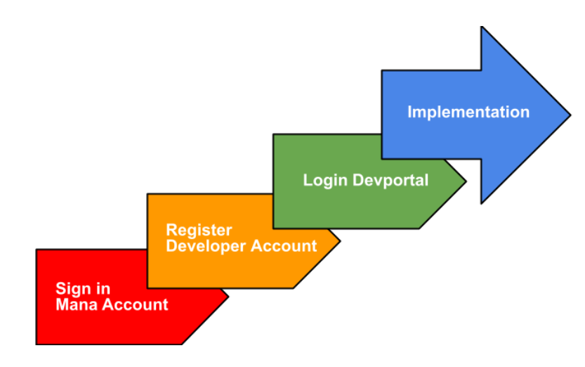
## การเปิดใช้งาน Mana User

 1.ผู้ใช้ทำการโหลด Mana Application จาก Store (AppStore, PlayStore)

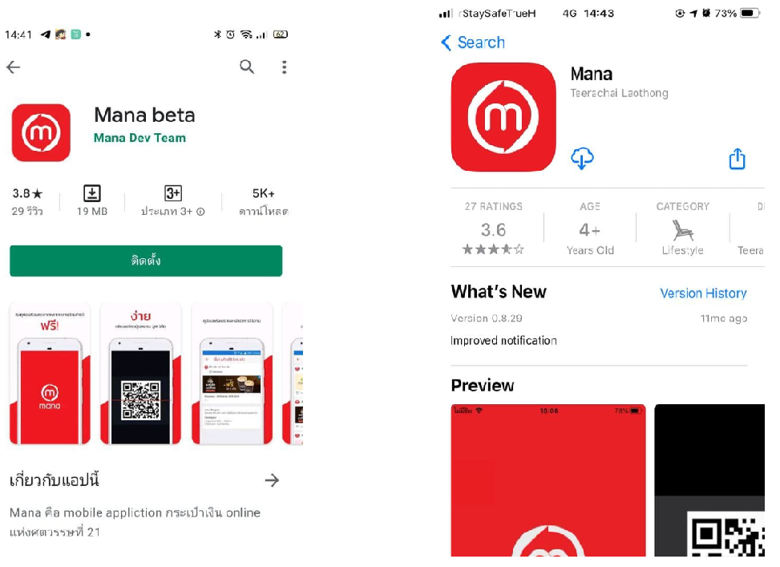

 ภาพที่1 (ซ้าย) Mana Application บน Store ของ Android  ,
(ขวา) Mana Application บน Store ของ IOS   

 2.ทำการ Log in เพื่อใช้งานโดยมีวิธีการดังนี้
 
2.1 ระบุหมายเลขโทรศัพท์เพื่อรับรหัส OTP

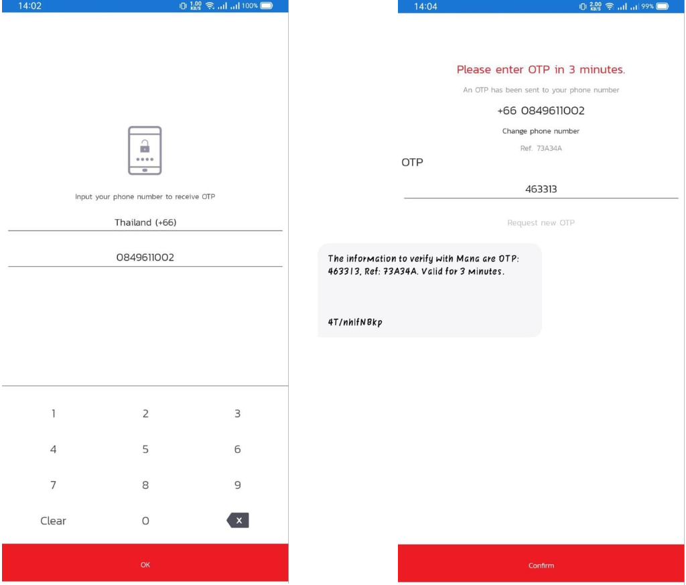

ภาพที่2  (ซ้าย) การระบุหมายเลขโทรศัพท์เพื่อรอรับ OTP,
(ขวา) การกรอก OTP ที่ได้รับจาก Message 

2.2 ระบุอีเมลล์เพื่อรับรหัส Code 

ภาพที่3 (ซ้าย) การระบุอีเมลล์เพื่อรอรับรหัส Code,
(ขวา) การกรอกรหัส Code ที่ได้รับจากอีเมลล์ 

 3.ทำการตั้งชื่อที่ใช้ในระบบ

ภาพที่4 การตั้งชื่อใน  Display name

 4.ตั้งค่า Pin ในการใช้งานครั้งแรก หลังจากนั้นจึงสามารถเข้าสู่หน้าหลักของ Mana Application ได้

ภาพที่5 (ซ้าย) การ Setup PIN ในการใช้งานครั้งแรก,
(ขวา) การยืนยันการ Setup PIN

 5.หากต้องการเข้าสู่ระบบในภายหลังสามารถใช้ Pin ที่ถูกตั้งค่าไว้

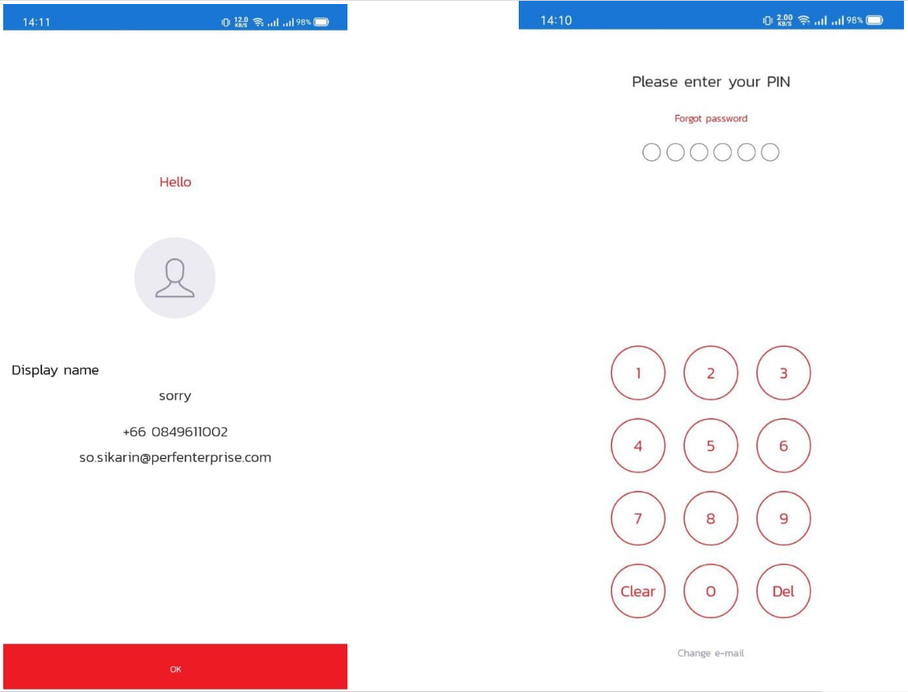

ภาพที่6 (ซ้าย) การแสดงผลของผู้ใช้ที่เคยลงทะเบียนแล้ว,
(ขวา) การกรอก PIN ที่เคย Setup ไว้ 

## การสมัครเพื่อเป็นนักพัฒนา
 1.กด Side menu แล้วเลือกเมนู 'สำหรับนักพัฒนา'

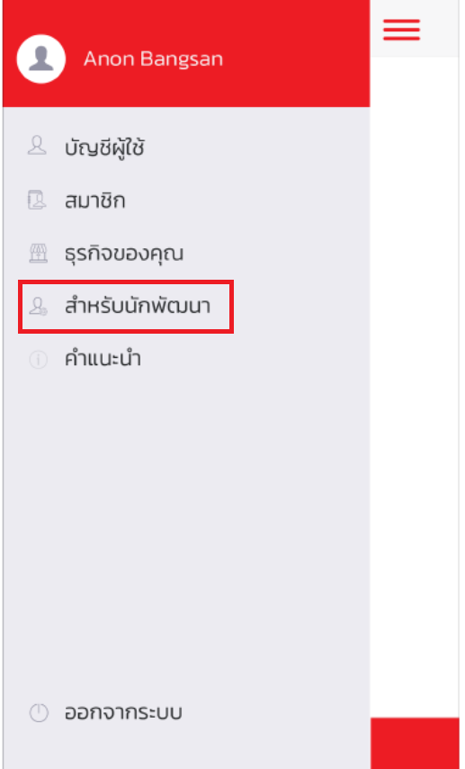

ภาพที่7 เมนูสำหรับนักพัฒนา

 2.หน้าเลือกบัญชีสำหรับนักพัฒนาจะมีรายการของธุรกิจทั้งหมดที่คุณเป็นเจ้าของและหรือเป็นพนักงาน ซึ่งหากกดเครื่องหมาย + ด้านบนขวา จะเป็นการสร้างบัญชีนักพัฒนา

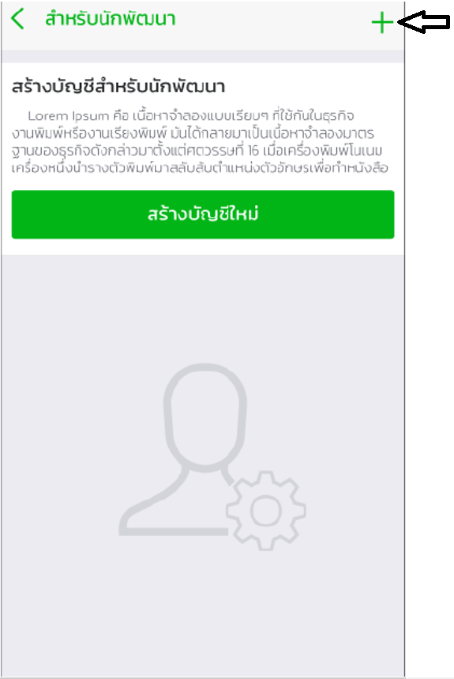

ภาพที่8 หน้าเลือกบัญชีสำหรับนักพัฒนา

 3.การสร้างบัญชีนักพัฒนาจำเป็นต้องกรอกข้อมูลตามภาพเพื่อทำการสร้างบัญชีใหม่ (เช่น ตั้งชื่อบัญชีนักพัฒนา, รูปภาพ, เบอร์โทร และสถานที่ตั้ง) 

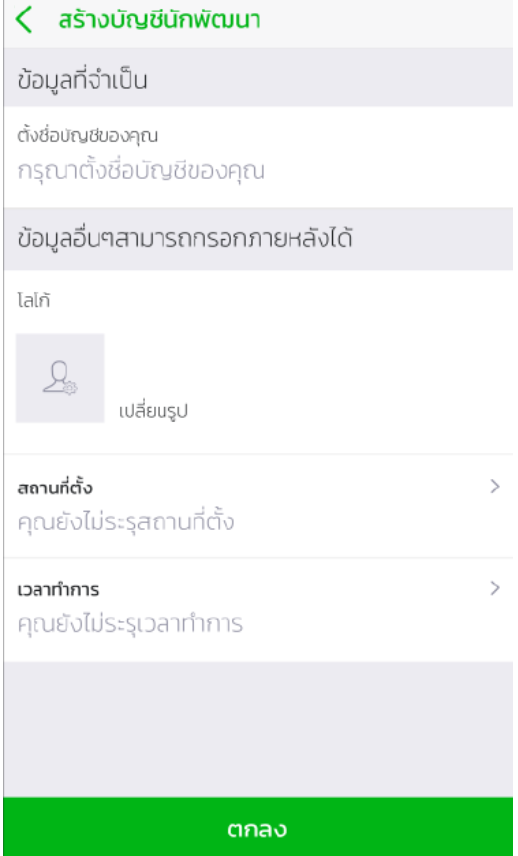

ภาพที่9  หน้าสร้างบัญชีนักพัฒนา

 4.เมื่อกรอกข้อมูลหน้าสร้างบัญชีนักพัฒนาเรียบร้อยแล้ว จะต้องรอการอนุมัติจาก Mana จึงจะเป็นการสำเร็จการสร้างบัญชีนักพัฒนา

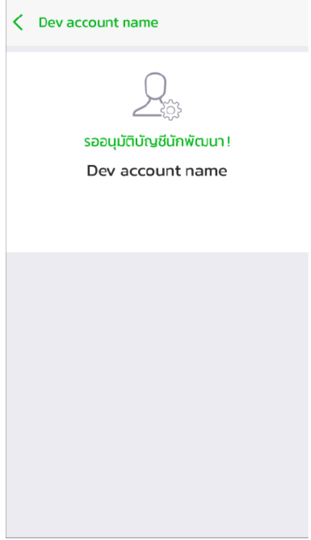

ภาพที่10 รอการอนุมัติจาก Mana

 5.เมื่อ Mana ยืนยันการอนุมัติแล้วทางนักพัฒนาจะสามารถใช้งาน DevPortal ได้และจะสามารถปรับแต่งการใช้งานบัญชีนักพัฒนาได้ดังรูป

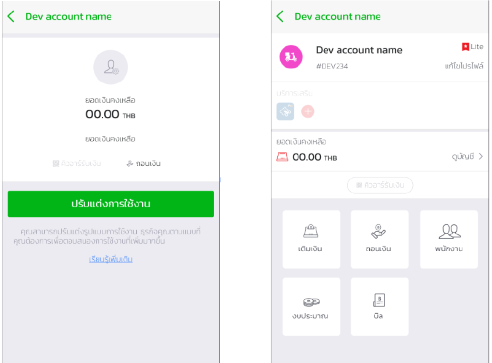

 ภาพที่11 (ซ้าย) การใช้งานบัญชีนักพัฒนาแบบเบื้องต้น,(ขวา) การใช้งานบัญชีนักพัฒนาอย่างเต็มรูปแบบ

 6.หากกลับมาที่หน้าเลือกบัญชีสำหรับนักพัฒนาอีกครั้งจะแสดงรายการธุรกิจที่ได้รับการอนุมัติจาก Mana 

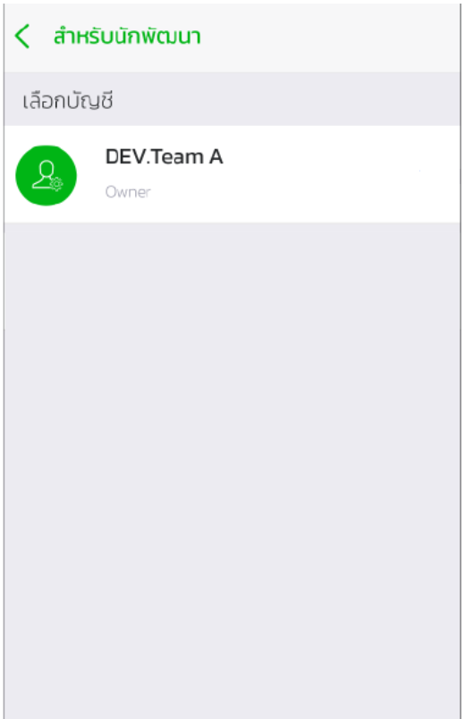

ภาพที่12 หน้าเลือกบัญชีสำหรับนักพัฒนา

## การ Log in เพื่อเข้าใช้งาน DevPortal

1.เปิดหน้า [DevPortal](https://mana-apim-sandbox-test.developer.azure-api.net/) เพื่อทำการ Sign in

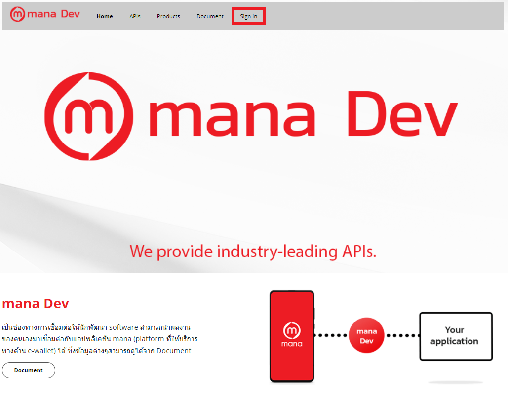

2.ใช้ Mana application สแกนเพื่อเข้าใช้งาน [ดูวิธีเปิดใช้งาน Mana User](GettingStarted.md)

<!-- 3.เมื่อ[สมัครเป็นนักพัฒนา](GettingStarted.md) เรียบร้อยแล้ว ต้องทำการสแกนเพื่อ Log in เข้าใช้งาน DevPortal ทาง mana จะมีการส่งคำขออนุญาตเพื่อใช้งาน DevPortal -->
3.จะมีการส่งคำขออนุญาตเพื่อยืนยันการใช้งาน DevPortal ใน Mana application 

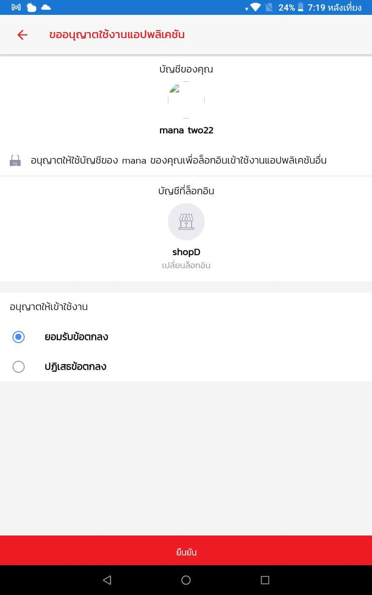

4.เลือกอนุญาตและยืนยันเพื่อ Login เข้าสู่ Devportal 

