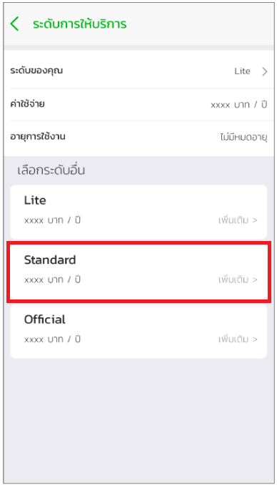

# ขั้นตอนการอัพเกรด Tier
หากเมื่อใดก็ตามที่นักพัฒนาต้องการที่เรียกใช้ APIs ที่หลากหลายขึ้น หรือต้องการที่จะเผยแพร่ระบบออกสู่ตลาด นักพัฒนาจำเป็นต้องใช้ Standard tier  หรือสูงขึ้นไปเท่านั้น โดยมีขั้นตอนการอัพเกรด Tier ดังนี้

1.ไปยัง Mana Application และเลือกเมนูบนซ้ายสำหรับนักพัฒนา

2.กด Lite ตามรูปด้านล่าง

3.เลือกเปลี่ยนระดับจาก Free เป็น Standard  

4.เลือกชำระและจ่ายเงิน

