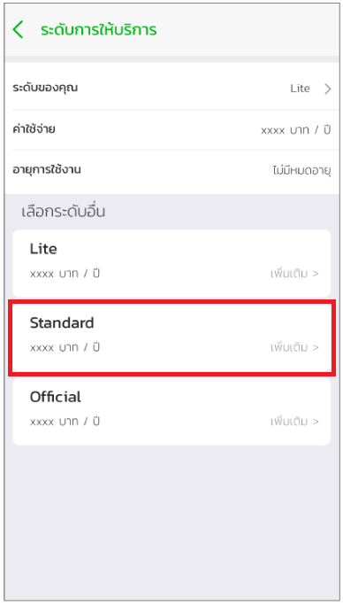

# ขั้นตอนการอัพเกรด tier
หากเมื่อใดก็ตามที่นักพัฒนาต้องการจะเปลี่ยนจากการทำงานที่อยู่บน Sandbox มาใช้ Production Environments นั้นสามารถทำได้โดยการ

1.ไปยัง Mana Application และเลือกเมนูบนซ้ายสำหรับนักพัฒนา

2.กด Lite ตามรูปด้านล่าง

3.เลือกเปลี่ยนระดับจาก Free เป็น Standard  

4.เลือกชำระและจ่ายเงิน

