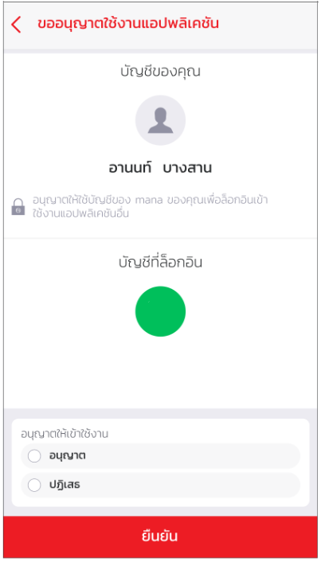
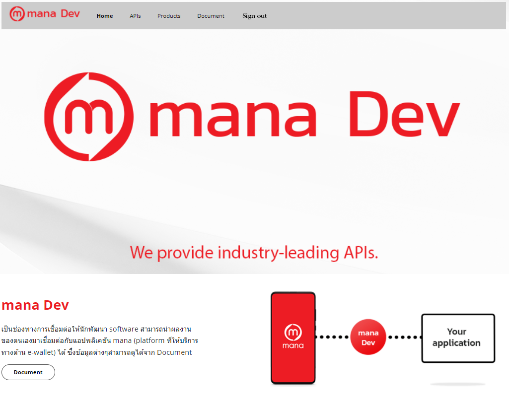

## การ Login เพื่อเข้าใช้งาน API-Management

1.[เปิดหน้า web Api management](https://mana-apim-sandbox-test.developer.azure-api.net/) เพื่อทำการ sign in

2.ใช้ Mana app สแกนเพื่อเข้าใช้งาน [เปิดใช้งาน mana User](GettingStarted.md)

3.เมื่อ[สมัครเป็นนักพัฒนา](GettingStarted.md) แล้วสแกนเพื่อ Login เข้าใช้งาน API-Management ทาง mana ก็จะส่ง consent มาถามว่าต้องการที่จะยอมรับที่จะเข้า Api management 

4.ถ้าเลือกอนุญาต แล้วยืนยันก็ทำการ Login เข้า Api management 

