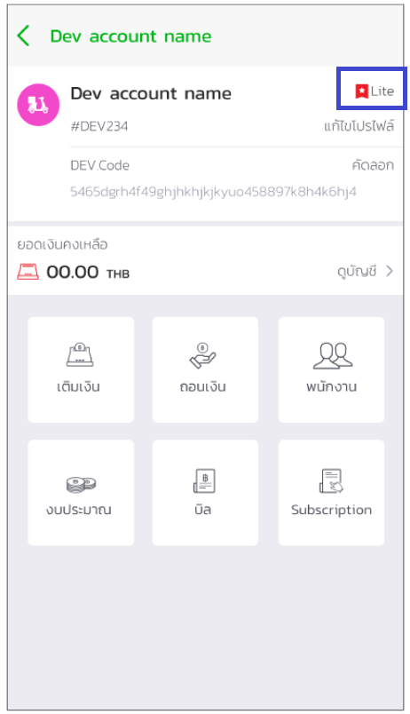
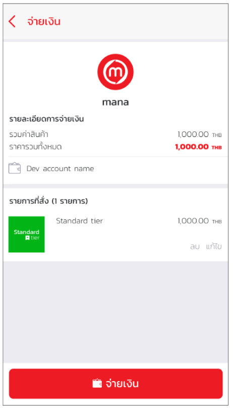

# From Sandbox to Production
หากเมื่อใดก็ตามที่นักพัฒนาต้องการจะเปลี่ยนจากการทำงานที่อยู่บน Sandbox มาใช้ Production Environments นั้นสามารถทำได้โดยการ

1.ไปยัง Mana Application และเลือกเมนูบนซ้ายสำหรับนักพัฒนา

2.เลือกเปลี่ยนระดับจาก Free เป็น Standard  

3.เลือกชำระและจ่ายเงิน

4.Login เข้าสู่ DevPortal โดยใช้ Production-Key ที่ได้มา เพื่อจะสามารถเข้าถึง APIs ต่างๆได้หลากหลายขึ้นรวมถึงการ Publish API  

### การตั้งค่าเพื่อใช้งานกับ Mana Production
เมื่อนักพัฒนาต้องการจะแก้ไขหรือเปลี่ยนแปลง Application, Server หรือ Configuration ของฝั่งนักพัฒนาเอง ให้สามารถใช้งานกับ Mana production ต้องนำ Production-Key ที่ได้มาจาก DevPortal ไปแก้ไขในระบบของนักพัฒนา ซึ่งรวมถึงการเปลี่ยน ฺBaseURL  จาก Sandbox เป็น Production 

