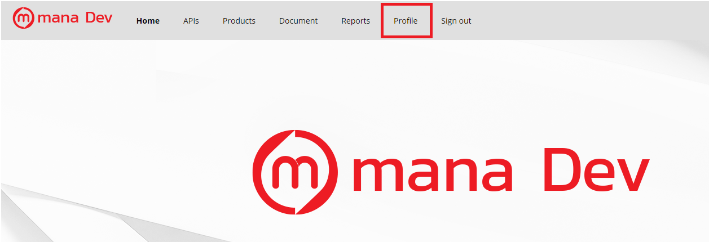
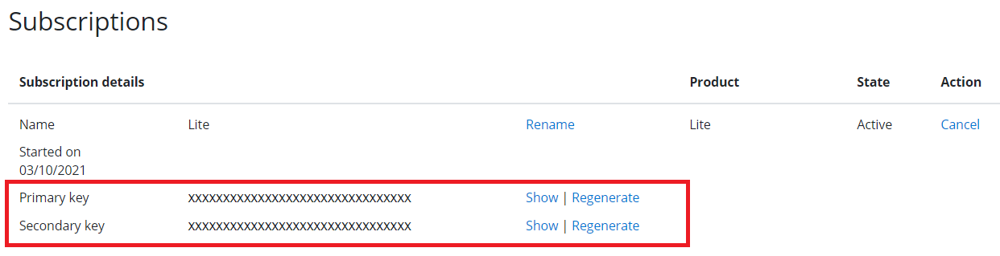

# FromSandbox to Production

ในระหว่างการพัฒนาระบบโดยปกติแล้วเมื่อทำการสมัครเป็นนักพัฒนาเรียบร้อยแล้วจะได้รับ Sandbox key เป็นตัวตั้งต้นซึ่งสามารถนำ key ที่ได้รับไปใช้ในระบบของทีมนักพัฒนาไม่ว่าจะเป็นการทำ Configuration หรือการตั้งค่า ฺBaseURL เพื่อทำการเชื่อมต่อกับ APIs ของ mana โดยการเข้าถึง Key นั้นสามารถทำได้ผ่านการ Sign in เข้าสู่ DevPortal และดูข้อมูลผ่านเมนู Profile

1.ทำการ Sign in ใน Devportal และไปที่เมนู Profile เพื่อนำ Key มาใช้งาน 

2.ในเมนู Profile จะแสดงข้อมูลของ Key ตามระดับของ Tier ที่ลงทะเบียนไว้

ซึ่งหากนักพัฒนาต้องการที่จะ[อัพเกรด Tier เป็นระดับ Standard หรือสูงขึ้น](../Quickstarts/stepUpgrade_tier.md)เพื่อร้องขอสิทธิเพิ่มเติมในการเข้าถึงข้อมูลซึ่งจะได้รับ Production Key เพื่อให้สามารถเข้าใช้งาน API ที่หลากหลายซึ่งรวมถึงการ Publish service 

การ Publish service นั้นเป็นการเปลี่ยนจากช่วงระยะพัฒนา (Development) ไปยังระยะเตรียมปล่อยระบบออกสู่สาธารณะ (Pre-release) ตาม[วงจรการพัฒนาระบบ](../Introduction/DevelopmentCycle.md) ซึ่งรวมถึงการเปลี่ยนจาก Sandbox มาใช้ Production environment ดังนั้นจึงต้องใช้ Production Key ในการทำงาน 

และหลังจากที่ทีมนักพัฒนาได้มีการทดสอบระบบในช่วง Pre-release เป็นที่เรียบร้อยแล้ว หากต้องการนำระบบเผยแพร่ออกสู่สาธารณะ จะต้องมีการแจ้งเข้ามาเพื่อให้ทาง mana ทำการตรวจสอบและเตรียมดำเนินการเผยแพร่ออกสู่สาธารณะ