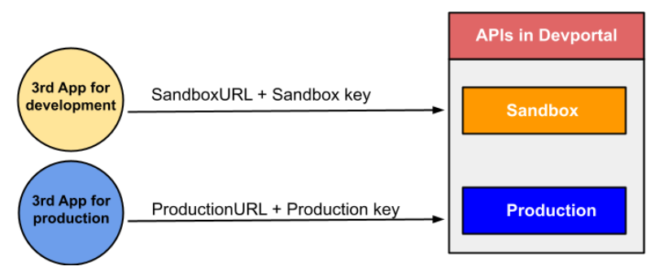

# FromSandbox to Production
During the development of the system, the developer team can connect the API to the mana by implementing a sandbox key (Subscriptions key). service, which requires the production key obtained by calling the API in Devportal and changing the BaseURL or doing a configuration. Along with working on that Environment, which from the above can be described as shown in the figure below.

Which from the picture above is the working of one application with more than one environment. Therefore, the mana team recommends that the developers team separate the test appication from the production appication and clearly define the access rights to the system's data and resources. This is to prevent Appication from cross-accessing data as shown in the example below.

<!-- คือการใช้ Sandbox ในการแยกการทำงานของแต่ละแอปพลิเคชันบนมือถือแบบ 1 แอปพลิเคชัน ต่อ 1 Sandbox และมีการกำหนดสิทธิในการเข้าถึงข้อมูลและทรัพยากรของระบบไว้อย่างชัดเจน ทำให้แอปพลิเคชันไม่สามารถเข้าถึงข้อมูลข้ามกันได้ แต่ในกรณีที่แอปพลิเคชันจำเป็นต้องแชร์ข้อมูล เข้าถึงข้อมูลของแอปพลิเคชันอื่น หรือข้อมูลของระบบ ก็ยังคงสามารถทำได้ผ่าน API ของระบบที่แต่ละเจ้าได้ทำรองรับไว้ให้ เพื่อร้องขอสิทธิเพิ่มเติมในการเข้าถึงข้อมูลที่จำเป็นอีกที
ที่ได้อธิบายไปข้างต้นนั้นคือทฤษฎีล้วน ๆ แต่เมื่อนำมาใช้จริงในทางปฏิบัติ บนระบบปฏิบัติการที่มีโครงสร้างต่างกัน แน่นอนว่านิยามของ Application Sandboxing ของแต่ละเจ้าก็จะต่างกันออกไป แต่ว่าก็ยังคงคุณสมบัติตามที่กล่าวไปข้างต้นได้เหมือนเดิม ต่อไปจะขอพูดถึง Application Sandboxing บนแต่ละระบบปฏิบัติการว่าแท้จริงแล้วเป็นอย่างไร
https://medium.com/incognitolab/introduction-to-application-sandboxing-on-mobile-platform-598d9c7aa8cf -->

<!-- ## การตั้งค่าการใช้งานใน Mana Production
เมื่อนักพัฒนาต้องการจะแก้ไขหรือเปลี่ยนแปลง Application Server หรือทำ Configuration ของทีมนักพัฒนาให้สามารถใช้งานกับ Mana production ต้องนำ Production-Key ที่ได้มาจาก DevPortal ไปแก้ไขในระบบของนักพัฒนา ซึ่งรวมถึงการเปลี่ยน ฺBaseURL จาก Sandbox เป็น Production  -->
