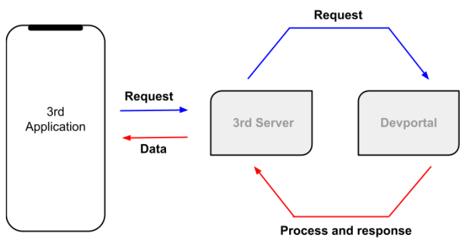

# Overview
**Mana application** เป็นกระเป๋าเงินอิเล็กทรอนิกส์รูปแบบหนึ่งซึ่งสามารถทำธุรกรรมการเงินส่วนบุคคล ร้านค้า หรือระดับองค์กร อีกทั้งยังเป็น Platform ชนิดหนึ่งที่เปิดให้นักพัฒนาภายนอก (3rd Party) สามารถเข้ามาพัฒนาระบบของตัวเองร่วมกันกับ mana

ยกตัวอย่างเช่น หากนักพัฒนาต้องการทำแอพลิเคชั่นที่เกี่ยวกับเครื่องซักผ้าหยอดเหรียญ ที่มีการสั่งให้เครื่องซักผ้าทำงานโดยอัตโนมัติเมื่อมีการสแกนจ่ายเงิน ดังนั้นจากตัวอย่างที่ยกมาข้างต้นเมื่อมี Transaction เกิดขึ้น 3rd Party จะสามารถรับรู้ข้อมูลของ Transaction นั้นได้หากทำการเชื่อมต่อกับ Service ที่ mana เปิดให้เรียกใช้ ซึ่งกระบวนการการเชื่อมต่อ Service ที่ว่านี้จะทำโดยผ่านตัวกลางที่ชื่อว่า [DevPortal](https://mana-sand-portal.developer.azure-api.net) 

**DevPortal**
เป็นตัวกลางในการเชื่อมต่อข้อมูลระหว่างระบบของ mana กับนักพัฒนาหรือระบบของนักพัฒนาเชื่อมต่อกลับมายัง mana ทั้งนี้จัดทำขึ้นเพื่อให้นักพัฒนาสามารถเข้าถึงข้อมูลต่างๆ ได้โดยที่ยังอยู่ในขอบเขตข้อตกลงที่ถูกกำหนดไว้ 

ซึ่งหลังจากที่นักพัฒนาทำการเชื่อมกับ DevPortal เรียบร้อยแล้วและต้องการทดลองเล่นความสามารถที่ถูกพัฒนาขึ้นมาใหม่นี้ก็สามารถทดลองเล่นได้ใน Sandbox environment  และเมื่อทีมนักพัฒนาทำการทดสอบระบบบน Sandbox environment จนเป็นที่พอใจแล้วก็สามารถ Publish service เพื่อเตรียมการ Launch ระบบให้เผยแพร่ออกสู่ตลาดเพื่อใช้งานจริง