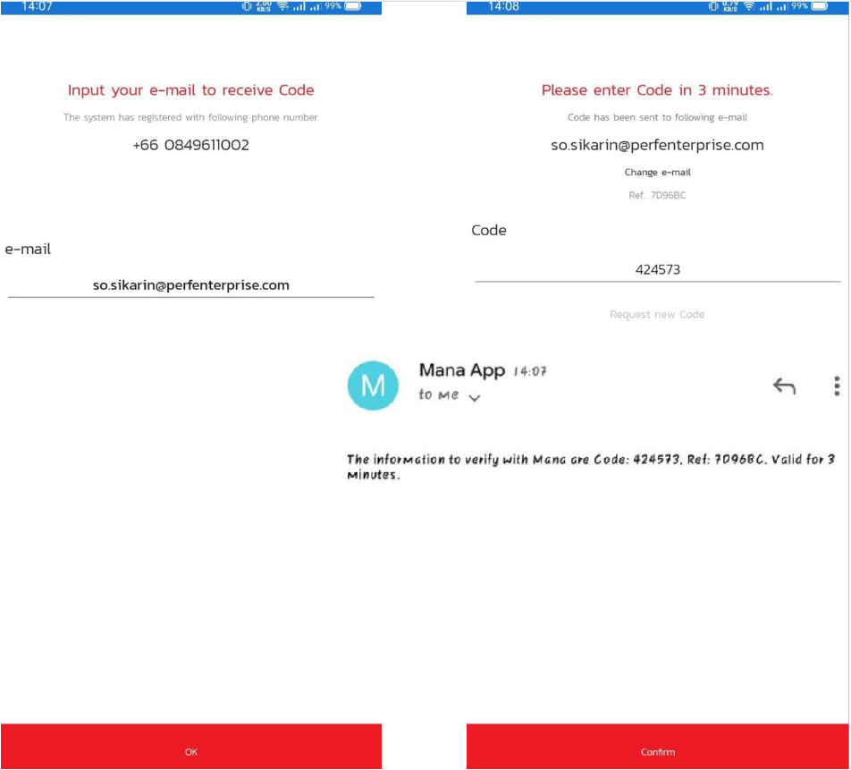
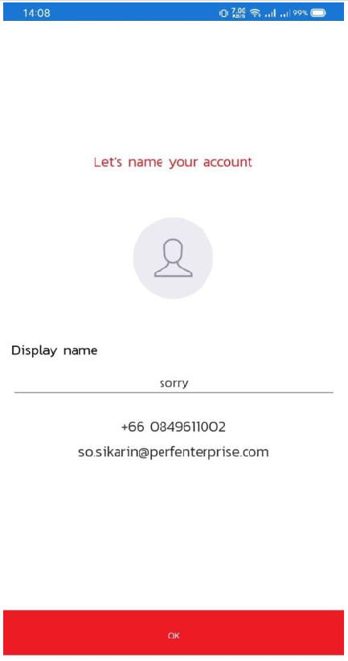
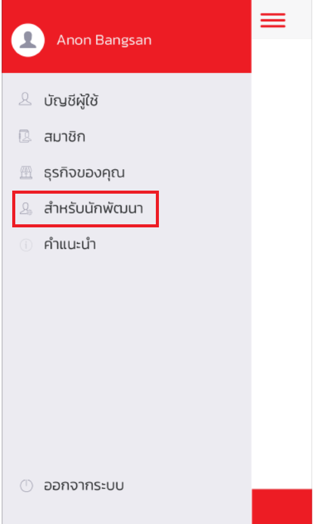
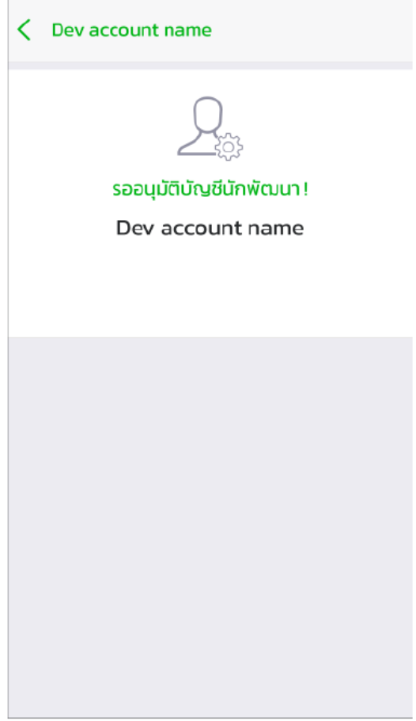
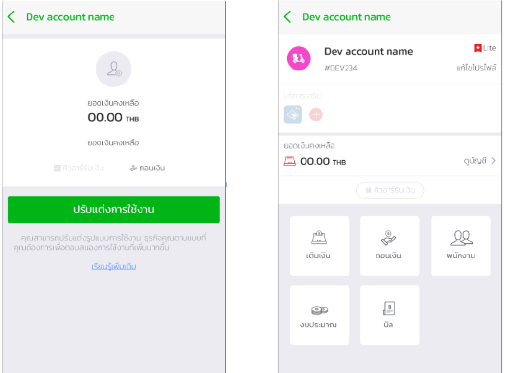
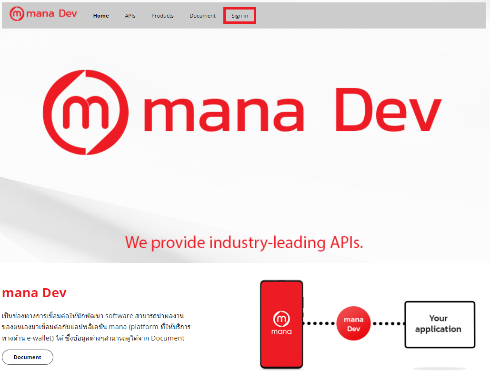

# Registering for Developers  
This can only be done if Mana User is enabled for authentication first. And once the authentication process is complete, you can register the developer fuction. according to the format below:

## Mana User Activation

 1.User load Mana Application from Store (AppStore, PlayStore).

Figure  1 (left) Mana Application on Android Store , (Right) Mana Application on IOS Store

 2.Log in to use with the following methods.
 
2.1 Enter a phone number to receive an OTP code.

Figure  2 (Left) Specifying a phone number to receive OTP, (Right) Entering OTP received from Message 

2.2 Enter your email to receive the code 

Figure  3 (left) specifying an email to receive a code, (right) entering a code received from an email

 3.Set the name used in the system.

Figure  4 Naming in Display name

 4.Set the Pin for the first time use. After that, you can go to the main page of Mana Application.

Figure 5 (Left) Setup PIN for first use, (Right) Confirmation of Setup PIN.

 5.If you want to log in later, you can use the pin that was set.

Figure 6 (Left) Display of the registered user, (Right) Entering the PIN that has been set up.

## Applying to become a developer 
 1.Press Side menu and select menu. 'For developers'

Figure 7. Developer menu.

 2.The developer account selection page contains a list of all businesses that you own and/or employ. If you press the + sign on the top right, it will create a developer account.า

Figure 8 Developer account selection page.

3.Creating a developer account is required to fill in the information as shown in the picture in order to create a new account (eg developer account name, picture, phone number and location). 

Figure 9 Developer account creation page

4.When you complete the developer account creation page. Will need to wait for Mana approval to successfully create a developer account.

Figure 10 is awaiting approval from Mana.

5.Once Mana has confirmed approval, developers will be able to use DevPortal and will be able to customize developer account usage as shown below.

Figure 11 (Left) Basic Developer Account Usage, (Right) Full Developer Account Usage

6.If you return to the Developer Account Select page again, a list of Mana approved businesses will be displayed. 

Figure 12 Developer account selection page
## Logging in to access the DevPortal 

1. Open the [DevPortal](https://mana-apim-sandbox-test.developer.azure-api.net/) page to sign in.

2.Use Mana application to scan to access. [ Learn how to enable Mana User.](GettingStarted.md)

<!-- 3.เมื่อ[สมัครเป็นนักพัฒนา](GettingStarted.md) เรียบร้อยแล้ว ต้องทำการสแกนเพื่อ Log in เข้าใช้งาน DevPortal ทาง mana จะมีการส่งคำขออนุญาตเพื่อใช้งาน DevPortal -->
3.A request for authorization will be sent to verify the use of DevPortal in the Mana application.

4.Select Allow and confirm to Login to Devportal.

