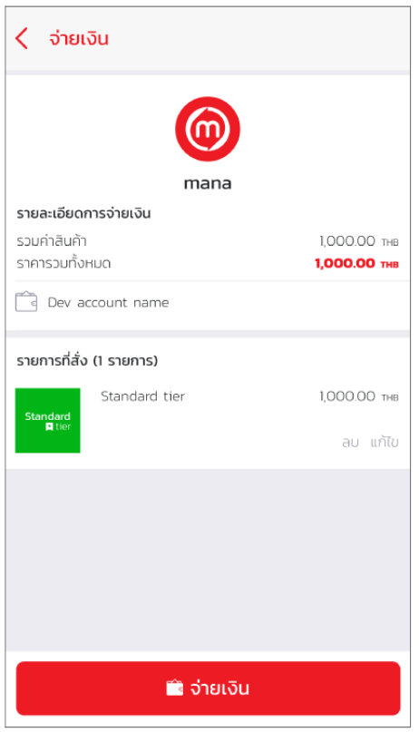

# Tier upgrade procedure
Whenever a developer wants to run a wider variety of APIs. or want to publish the system to the market Developers are required to use Standard tier or higher only. The steps for upgrading the Tier are as follows:

1.Go to Mana Application and select Developer menu on the left.

2.Press 'Lite' as shown below

3.Choose to change the level from Free to Standard.  

4.Choose to pay and pay

