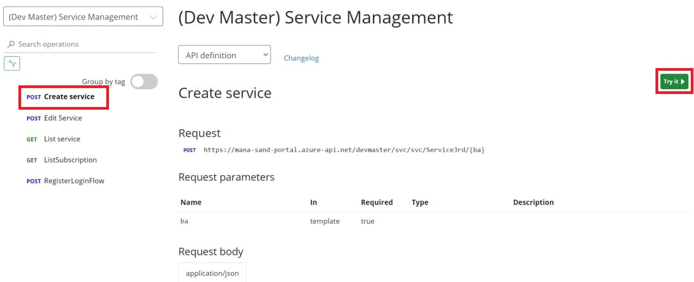
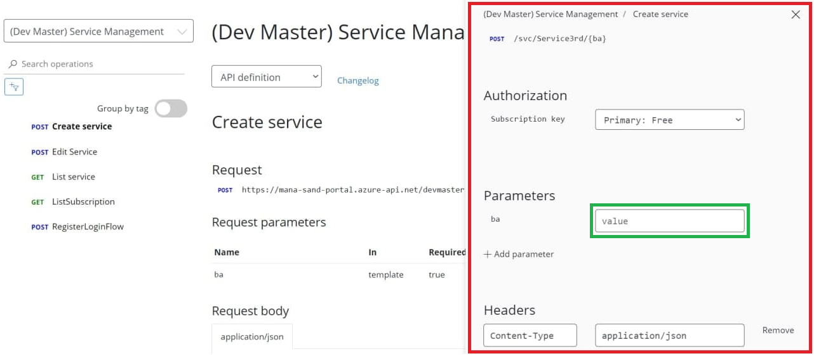
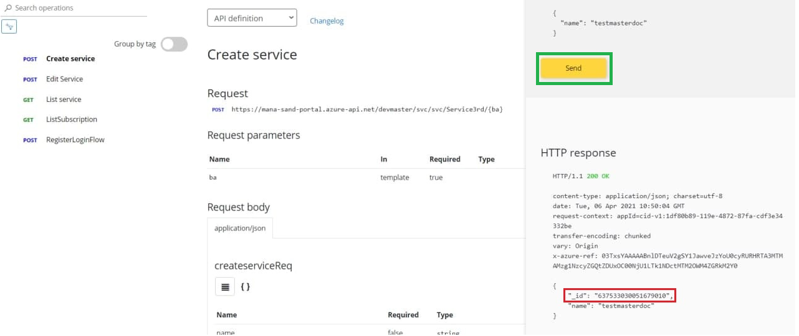

# การสร้าง Service
**Service** หรือระบบที่ถูกสร้างขึ้นมาเพื่อรองรับหรือตอบโจทย์กับการใช้งานในธุรกิจต่างๆ ซึ่งระบบที่ว่านี้จะถูกพัฒนาโดยนักพัฒนาภายนอก (3rd party)
ซึ่งหากนักพัฒนาจะสร้าง Service ต้องทำการสร้างใน Devportal โดยมีขั้นตอนดังนี้

1.เลือกหมวด [API Service Management](../apis/APIs.md) เลือก Create Service และ Try it

2.กรอกข้อมูลให้ครบถ้วน

3.หลังจากทำการสร้าง Service เป็นที่เรียบร้อยแล้ว นักพัฒนาจะได้รับ ServiceID กลับมาซึ่งในการเข้าใช้งาน APIs อื่นๆ อาจต้องทำการส่ง ServiceID แนบไปด้วย

