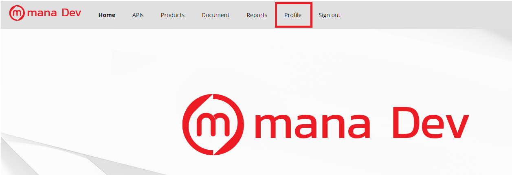
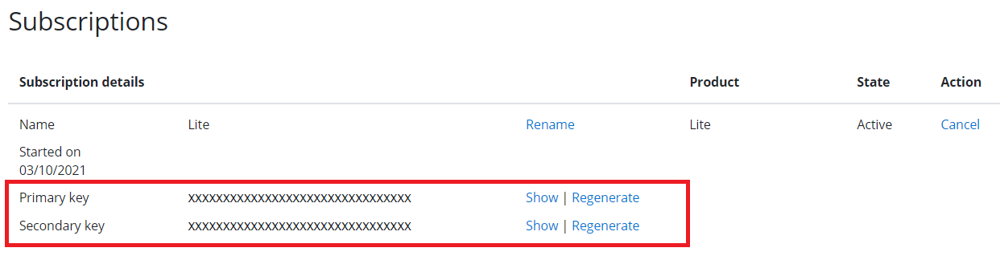

# FromSandbox to Production

ในระหว่างการพัฒนาระบบโดยปกติแล้วเมื่อทำการสมัครเป็นนักพัฒนาเรียบร้อยแล้วจะได้รับ Sandbox key (Subscriptions key) เป็นตัวตั้งต้นซึ่งสามารถนำ key ที่ได้รับไปใช้ในระบบของทีมนักพัฒนาไม่ว่าจะเป็นการทำ Configuration หรือการตั้งค่า ฺBaseURL เพื่อทำการเชื่อมต่อกับ APIs ของ mana โดยการเข้าถึง Key นั้นสามารถทำได้ผ่านการ Sign in เข้าสู่ DevPortal และดูข้อมูลผ่านเมนู Profile

1.ทำการ Sign in ใน Devportal และไปที่เมนู Profile เพื่อนำ Key มาใช้งาน 

2.ในเมนู Profile จะแสดงข้อมูลของ Key ตามระดับของ Tier ที่ลงทะเบียนไว้

หากนักพัฒนาต้องการที่จะ[อัพเกรด Tier เป็นระดับ Standard หรือสูงขึ้น](../Quickstarts/stepUpgrade_tier.md)เพื่อขอสิทธิ์เข้าถึงข้อมูลที่มากขึ้น เมื่อทำการอัพเกรด Tier แล้วจะสามารถเรียกใช้ APIs ได้มากขึ้นตามระดับ Tier ที่ได้อัพเกรดไว้ ซึ่งรวมถึงการ Publish service

ฉะนั้นการ Publish service จึงเป็นการเตรียมการเปลี่ยนจากช่วงระยะพัฒนา (Development) ไปยังระยะเตรียมปล่อยระบบออกสู่สาธารณะ (Pre-release) ตาม[วงจรการพัฒนาระบบ](../Introduction/DevelopmentCycle.md) และรวมถึงการเตรียมการเปลี่ยนจาก Sandbox มาใช้ Production environment 

ดังนั้นหากต้องการเชื่อมต่อกับ APIs ของ Production environment จำเป็นต้องใช้ Production Key ในการทำงานซึ่งการจะนำ Production Key มาใช้งานนั้นต้องทำการเรียกผ่าน API (production subscriptions) ใน DevPortal และทำการ Configure หรือตั้งค่า ฺBaseURL เพื่อทำการเชื่อมต่อกับ APIs ของ Production environment 

รูปตัวอย่าง call api

และหลังจากที่ทีมนักพัฒนาได้มีการทดสอบระบบในช่วง Pre-release เป็นที่เรียบร้อยแล้ว หากต้องการนำระบบเผยแพร่ออกสู่สาธารณะ จะต้องมีการแจ้งเข้ามาเพื่อให้ทาง mana ทำการตรวจสอบและเตรียมดำเนินการเผยแพร่ออกสู่สาธารณะผ่านการเรียกใช้ API (Service publish)