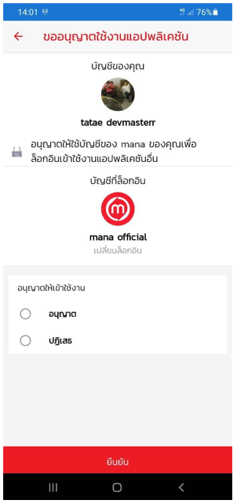
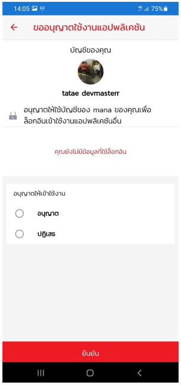

# RegisterLoginFlow
 
การเรียกใช้ APIs ResgisterLoginFlow เพื่อให้ mana กับ 3rd สามารถทำงานร่วมกันได้ โดย mana จะส่งค่า LoginFlowId  เพื่อให้ทางนักพัฒนาระบบมาทำการตั้งค่า Config ใน Service ที่ทางนักพัฒนาระบบทำขึ้น  

## เอาค่า LoginFlowId

1.เข้า Web Devportal แล้วทำการ Login 

3.เข้าใน APIs แล้วไปที่หมวดหมู่ Service Management

4.กดที่ APIs post ResgisterLoginFlow แล้วกด Try it 

5.เอาค่า ServiceId ที่ได้จากตอนสร้าง Services  มาใส่ใน ค่า Value ของ serviceId

ใส่ค่า Body โดยเป็นเงื่อนไขของ Service ที่จะให้ User Mana สามารถ Login เข้าใช้งานได้ ตัวอย่าง
```
{
  "baId": "string",
  "allowUser": true,
  "allowEmployee": true,
  "allowOwner": true,
  "minimumBizAccountTier": "string",
  "bizAccountType": "string",
  "bizAccountLogisticType": "string",
  "signInCallback": "string",
  "signOutCallback": "string",
  "appCallback": "string"
}
```
กรอกข้อมูลครบแล้วกด Send เพื่อเอาค่า LoginFlowId ได้เลย

## Login 3rd โดยใช้ User Mana Login 

1.มีหน้า web Login เพื่อให้ User Mana ใช้ Login

2.User Mana กด Login ซึ่งในกรณีที่ยังไม่ยืนยันตัวตน  mana จะส่ง QR มาเพื่อให้ User สแกน Login เข้าไปแทน

3.User Mana ใช้ App mana ทำการสแกน QR จะมีการเรียกใช้ API IDP(เปลี่ยนชื่อ API) โดยจะส่งค่า ServiceId และ LoginFlowId เพื่อเช็คว่า User Mana คนนั้นมีสิทธิ์ Login เข้าใช้งานตามเงื่อนไขที่ 3rd กำหนดไว้ได้หรือไม่
- สแกน QR แล้วตรงตามเงื่อนไขที่ตรงตามที่ 3rd กำหนดจะสามารถเห็น Service ที่ 3rd สร้างขึ้นมาดังรูป  




- สแกน QR แล้วไม่ตรงตามเงื่อนไขที่ตรงตามที่ 3rd กำหนดจะไม่ขึ้น Service ที่ 3rd สร้างขึ้น ดังรูป  





