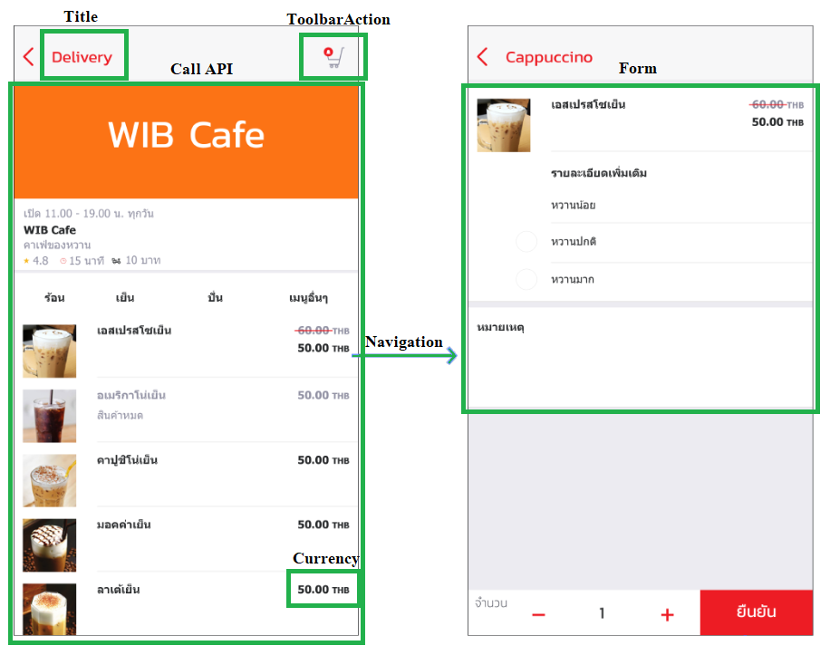

# Mana library
การแสดงหน้าเพจใน Mana มีองค์ประกอบที่สามารถแบ่งตามความสามารถได้ดังรูป    
      
ฉะนั้นคำสั่งหรือความสามารถต่างๆที่มีใน Mana library จึงแบ่งได้ตามหัวข้อด้านล่าง
## Call API
* Call API to Registered URL   
  * Getapidata : ดึงข้อมูลจาก Server โดยการส่งระบุหน้าที่ต้องการเปิด (mcontentId) เพื่อให้ Server ตอบกลับ   
  * getApiDataWithEndpointId // ไม่มีตัวไหนเรียกใช้    
* Call Api to external    
  * CallApiGet : ดึงข้อมูลจาก Server โดยระบุ URL ที่ได้ลงทะเบียนไว้กับ Mana  
  * CallApiPost     // ไม่มีตัวไหนเรียกใช้  
  * CallApiDelete    // ไม่มีตัวไหนเรียกใช้  

## Form 
เป็นรูปแบบของการกรอกข้อมูลเพื่อส่งข้อมูลเข้าไปประมวลผลในฝั่ง Server โดยมี Form ดังต่อไปนี้
* .validForm : เป็นการตรวจสอบข้อมูลให้เป็นไปตามเงื่อนไขที่กำหนดเพื่อเปิด/ปิดการใช้งานของปุ่มตกลง
* .submitFormData : ส่งข้อมูลที่ผ่านการตรวจสอบแล้วไปยัง Server
* .confirmForm : แสดง Dlg ยืนยันการทำงานซึ่งจะได้รับค่า boolean กลับมา (resolve.isConfirm)
* .submitFormDataWithEndpointId //อาจจะยังไม่ได้ใช้

```typescript
export class DemoPage implements OnInit {

  public isFirstTime: boolean = true;
  public fg: FormGroup;
  constructor(private svc: IonManaLib) { }

  onSave() {
  if (this.isFirstTime) {
    this.isFirstTime = false;
  }
  this.updateValidationFormToClient();

  if (this.fg.valid) {

    let msg = this.fg.get("isAgree").value == "true" ? "ยืนยันข้อตกลง" : "ปฏิเสธข้อตกลง";

    let message = new confirmMessage("",
      "<span style=\"color: Black; \">คุณต้องการ" + msg + "</span>"
    );

    // 
    this.svc.confirmForm(message).then(resolve => {
      if (resolve.isConfirm) {
        let isAgree = this.fg.get("isAgree").value;
        this.fg.get("isAgree").setValue(isAgree == "true");
        // ส่งข้อมูลที่ได้รับไปยัง Server
        this.svc.submitFormData(this.mcontentid, this.fg.value);
      }
    });
  }
}

  // เช็คความถูกต้องของข้อมูลเพื่อเปิด/ปิดการใช้งานของปุ่มตกลง 
  // ถ้าเป็น True ปุ่มจะสามารถกดได้แต่ในทางตรงข้ามถ้าเป็น False ปุ่มจะไม่สามารถกดได้
  updateValidationFormToClient() {
    this.svc.validForm(this.isFirstTime || this.fg.valid)
  }
}  
```
* .selectimage //เลือกรูปที่อยู่ในฟอร์ม ex:merchant-profile-image-edit
* .optionDialog : เป็นการเปิดหน้าเพจที่เป็น Dialog ซึ่งเพจที่เปิดนั้นสามารถเป็นฟอร์มที่ให้กรอกข้อมูลได้หลายรูปแบบ
```typescript
export class DemoPage implements OnInit {

  constructor(private svc: IonManaLib) { }

  openMobileDialog() {
    let defaultValue = { mobile: this.fg.get("mobile").value };
    let mcid_optiondialog = "demo";
    this.svc.showOptionDialog(mcid_optiondialog, defaultValue).then((response) => {
      let status = response.isOk ? "ok" : "cancel";
      if (status == "ok") {
        // do something
      }
    });
  }
}
```
* .customNumpad : แสดงแป้นคีย์บอร์ดที่สามารถคีย์ได้เฉพาะตัวเลขเท่านั้น
```html
ionic
    <ion-label for="customInputAmount">
        <h2>จำนวนเงินที่ต้องการเติม</h2>
    </ion-label>
    <ion-input type="text" id="customInputAmount" customInput="true" ></ion-input>

html
    <label for="customInputAmount">จำนวนเงินที่ต้องการเติม</label>
    <input customInput="true" type="text" class="form-control" id="customInputAmount">
```


## GPS
* Get GPS ใช้ gps หัวด้านบนของมานะ // ไม่เห็นหน้าที่เรียกใช้
* .setGpsSection : ใช้กำหนดตำแหน่ง GPS ที่อยู่ใน body ด้านบนของมานะ
```typescript
export class DemoPage implements OnInit {
  constructor(private svc: IonManaLib) { }

  ionViewDidEnter() {
    let load$ = this.loadData$();
    this.formData$ = load$;
    load$.then(it => {
      let location = it.address.location;
      this.svc.setGpsSection(location.title, location.realm, location.subDistrict, location.district, location.province, location.postalCode, location.accuracy, location.geolocation.latitude, location.geolocation.longitude, location.phoneNumber, location.remark);
      this.hasLoaded = it ? "y" : "n";
    });
    this.updateValidationFormToClient();
  }
}
``` 

## Title
เป็นการกำหนดหัวเรื่อง/ชื่อหน้า ให้กับเพจนั้นๆ ซึ่งโดยทั่วไปสามารถกำหนดหัวเรื่องได้จาก html โดยตรงหรือกำหนดจากข้อมูลที่ได้รับจากฝั่ง Server ซึ่งหากเป็นอย่างหลังจำเป็นจะต้องเรียกใช้คำสั่ง .initPageApi อีกครั้งหลังได้รับข้อมูลเพื่อทำการ Set tiltle ให้กับหน้านั้นๆ
```typescript
export class DemoPage implements OnInit {

  public title = "ร้านของคุณ";
  private mcontentid = "merchant";
  constructor(private svc: IonManaLib) { }

  refreshCallBack() {
    let load$ = this.loadData$();
    this.data$ = load$;
    load$.then((it: any) => {
      this.title = it.name != null ? it.name : this.title;
      // ใช้คำสั่ง initPageApi อีกครั้งหลังได้รับข้อมูล
      this.svc.initPageApi(this.mcontentid);
    });
  }
}
  ```
  
## ToolbarAction
ปุ่มเมนู ShortCut ที่แสดงด้านบนขวาของแอพโดยจะทำงานตามฟังก์ชั่นที่ถูกเขียนไว้
```typescript
export class DemoPage implements OnInit {

  private mcontentid = "demo";
  constructor(private svc: IonManaLib) { }

  ionViewDidEnter() {
  this.svc.addToolbarAction((action) => this.onTabToolbarItem(action));
  this.refreshCallBack();
  }

  //
  public onTabToolbarItem(action) {
    switch (action) {
      case "Add": this.Add(); break;
      default: break;
    }
  }

  //ฟังก์ชั่นการทำงานที่ถูกเขียนไว้ตาม action 
  public Add() {
    if(this.createEnpointUrl) this.svc.visitEndpoint(this.mcontentid, this.createEnpointUrl);
  }
  
}
  ```

## Navigation
* .visitEndpoint : เป็นการเปิดหน้าเพจตาม URL ที่ได้ลงทะเบียนไว้กับ Mana
```typescript
export class DemoPage implements OnInit {
  constructor(private svc: IonManaLib) { }

  public onManage() {
    this.svc.visitEndpoint(this.mcontentid, "https://s.manal.ink/np/neaclst-home");
  }
}  
```   
* .callTrigger //กดปุ่มเพื่อ call fc. //อาจจะไม่ได้ใช้
## Currency ex:shopping-cart-pay
เป็นการแสดงจำนวนเงินโดยสามารถกำหนด ได้ว่าจะแสดงแค่ตัวเลข, สกุลเงิน หรือแสดงทั้งหมด     

<!-- ```typescript
  console.log(this.svc.getAmount({THB:204})); // 204
  console.log(this.svc.getCurrency({THB:204}); // THB
  console.log(this.svc.getMonetaryDisplay({THB:204}); // 204 THB
``` -->

```typescript
export class DemoPage implements OnInit {

  public amount = {THB: 204};
  constructor(private svc: IonManaLib) { }
  
  public GetAmount(value: any) { 
    return this.svc.getAmount(this.amount); 
  }

  public GetCurrency(value: any) { 
    return this.svc.getCurrency((this.amount); 
  }
  // getDisplay
  public GetMonetaryDisplay(value: any) { 
    return this.svc.getMonetaryDisplay((this.amount); 
  }
}

  // This code example produces the following output:
  console.log(this.svc.getAmount(this.amount)); // 204
  console.log(this.svc.getCurrency((this.amount)); // THB
  console.log(this.svc.getMonetaryDisplay((this.amount)); // 204 THB
```
## Etc.
* .setButtonVisibility //ทำให้ปุ่มหาย ยังไม่เห็นหน้าไหนเรียกใช้
* .setStateChangedHandler  
เมื่อแอพได้รับ Notification หรือ SignalR หน้าๆนั้นจะทำการแสดงข้อมูลตามฟังก์ชั่นที่เขียนไว้
```typescript
export class DemoPage implements OnInit {
  constructor(private svc: IonManaLib) { }
  ionViewDidEnter() {
    this.svc.setStateChangedHandler((param) => this.OnStateChanged(param));
    this.refreshCallBack();
  }

    OnStateChanged(state: string) {
      // TODO
  }
}  
```    
* .initPageApiWithCallBack   
หากมีการ Navigate ไปหน้าอื่นและมีการกลับมาที่หน้าเดิมอีกครั้งจะสั่งให้หน้าเพจทำอะไรต่อ หรือหากมีการพับแอพลงเมื่อเปิดแอพขึ้นมาอีกครั้งหน้าที่ถูกเปิดค้างไว้จะให้ทำอะไรต่อ
```typescript
export class DemoPage implements OnInit {
  constructor(private svc: IonManaLib) { }
  private loadData$() {
    // ในที่นี้คือทำตามคำสั่งที่ของฟังก์ชั่น refreshCallBack
    return this.svc.initPageApiWithCallBack(this.mcontentid, () => this.refreshCallBack())
      .then(_ => {
        return this.svc.callApiGet(this.mcontentid, this.apiUrl);
      })
  }
}  
```      
* .initPageApi : ระบุหน้าที่จะใช้งานให้กับ Server เพื่อที่จะได้เตรียมข้อมูลมาแสดงได้อย่างถูกต้อง
        